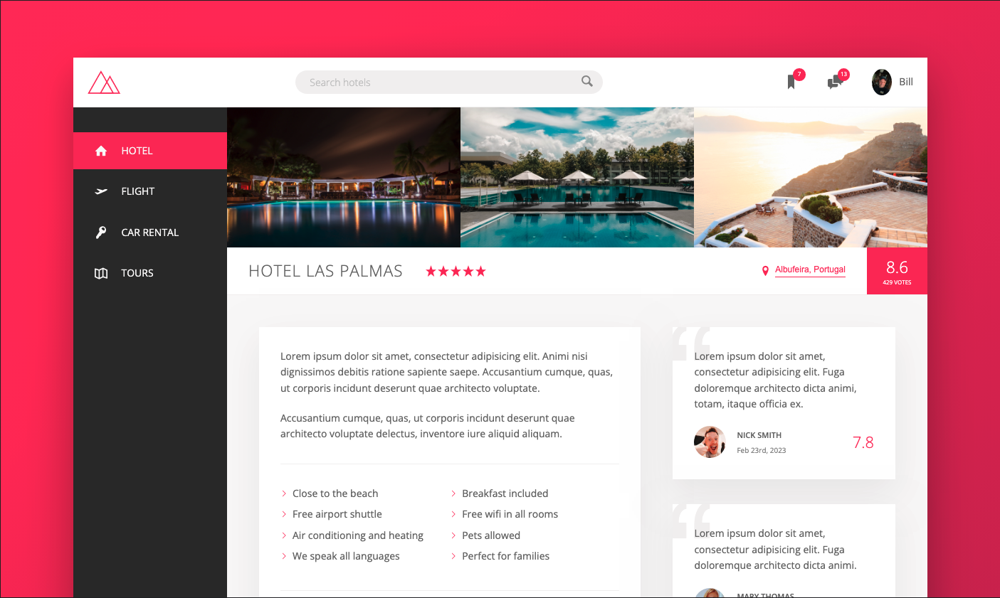

# Trillo 

  ## Description

  Trillo is a sample travel website built using advanced CSS / SCSS techniques including flexbox and animations.  The website features a responsive design with photos, user reviews and ratings, and animated buttons.
  
  
  ## Table of Contents
  
  - [Installation](#installation)
  - [Usage](#usage)
  - [License](#license)
  - [Contributing](#contributing)
  - [Tests](#tests)
  - [Questions](#questions)
  
  ## Installation
  
  deployed URL:  https://billstephens2022.github.io/Trillo/
  
  ## Usage
  
  deployed URL:  https://billstephens2022.github.io/Trillo/

  ## License
This application is covered under the MIT License.
 For more information: https://opensource.org/licenses/MIT
  
  ## Contributing
  N/A
  
  ## Tests
  N/A

  ## Questions
  Contact Info 
  GitHub user name: BillStephens2022 
  Link to GitHub profile: https://github.com/BillStephens2022 
  Email: stephensbill17@gmail.com
  